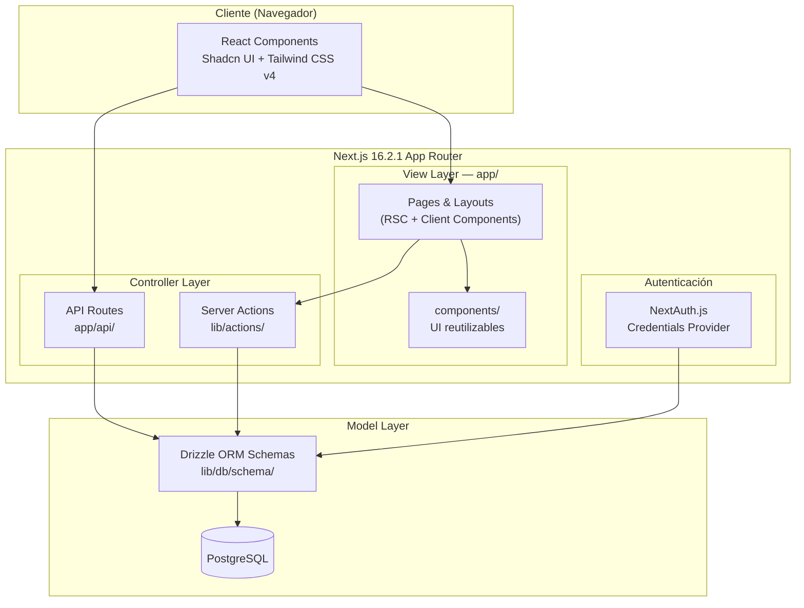
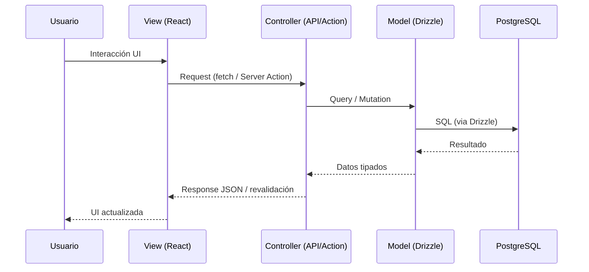
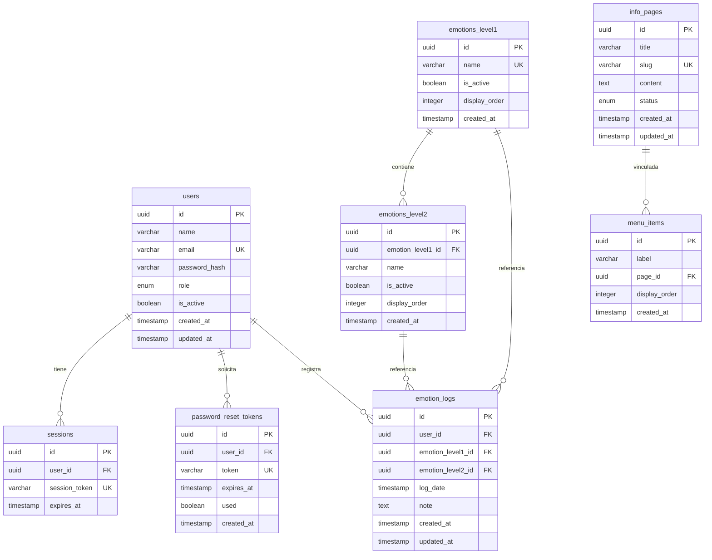

# Documento de Diseño — CESIZen

## Visión General (Overview)

CESIZen es una plataforma web de salud mental desarrollada con Next.js 16.2.1 (App Router), PostgreSQL con Drizzle ORM, Tailwind CSS v4 y Shadcn UI. La aplicación sigue una arquitectura MVC mapeada al ecosistema Next.js:

- **Model**: Esquemas Drizzle ORM en `lib/db/schema/`
- **View**: Componentes React en `app/` (pages/layouts) y `components/` (UI reutilizable)
- **Controller**: API Routes en `app/api/` y Server Actions

La aplicación implementa 3 módulos:
1. **Comptes utilisateurs** — Registro, login, perfil, reinicio de contraseña, administración de cuentas
2. **Informations** — CMS para páginas de salud mental con menús dinámicos
3. **Tracker d'émotions** — Diario emocional con referencial de 2 niveles y reportes por período

La interfaz está íntegramente en francés (`lang="fr"`), con diseño Mobile First y conformidad RGPD.

## Arquitectura

### Diagrama de Arquitectura General



### Diagrama de Flujo MVC



### Estructura de Carpetas

```
cesizen/
├── app/
│   ├── (public)/                  # Grupo: rutas públicas (Front-Office)
│   │   ├── page.tsx               # Página de inicio
│   │   ├── login/page.tsx
│   │   ├── register/page.tsx
│   │   ├── reset-password/page.tsx
│   │   ├── info/[slug]/page.tsx   # Páginas de información
│   │   └── layout.tsx             # Layout público con nav
│   ├── (auth)/                    # Grupo: rutas autenticadas
│   │   ├── profile/page.tsx
│   │   ├── tracker/
│   │   │   ├── page.tsx           # Journal de bord
│   │   │   ├── new/page.tsx       # Nueva entrada
│   │   │   ├── [id]/edit/page.tsx # Editar entrada
│   │   │   └── report/page.tsx    # Reporte por período
│   │   └── layout.tsx
│   ├── (admin)/                   # Grupo: Back-Office
│   │   ├── admin/
│   │   │   ├── users/page.tsx
│   │   │   ├── info-pages/page.tsx
│   │   │   ├── menu/page.tsx
│   │   │   ├── emotions/page.tsx
│   │   │   └── layout.tsx
│   │   └── layout.tsx
│   ├── api/
│   │   ├── auth/[...nextauth]/route.ts
│   │   ├── users/route.ts
│   │   ├── info-pages/route.ts
│   │   ├── menu-items/route.ts
│   │   ├── emotions/route.ts
│   │   └── tracker/
│   │       ├── route.ts
│   │       └── report/route.ts
│   ├── layout.tsx                 # Root layout (lang="fr")
│   └── globals.css
├── components/
│   ├── ui/                        # Shadcn UI components
│   ├── forms/                     # Formularios reutilizables
│   ├── layout/                    # Header, Footer, Nav, Sidebar
│   └── tracker/                   # Componentes del tracker
├── lib/
│   ├── db/
│   │   ├── index.ts               # Conexión Drizzle + pool
│   │   ├── schema/
│   │   │   ├── users.ts
│   │   │   ├── sessions.ts
│   │   │   ├── password-reset-tokens.ts
│   │   │   ├── info-pages.ts
│   │   │   ├── menu-items.ts
│   │   │   ├── emotions.ts
│   │   │   └── emotion-logs.ts
│   │   └── index.ts               # Re-export de todos los schemas
│   ├── actions/                   # Server Actions
│   │   ├── auth.ts
│   │   ├── users.ts
│   │   ├── info-pages.ts
│   │   ├── emotions.ts
│   │   └── tracker.ts
│   ├── auth.ts                    # Configuración NextAuth.js
│   ├── validators/                # Zod schemas de validación
│   │   ├── auth.ts
│   │   ├── info-pages.ts
│   │   ├── emotions.ts
│   │   └── tracker.ts
│   └── utils.ts                   # Utilidades generales
├── middleware.ts                   # Protección de rutas
└── drizzle.config.ts              # Configuración Drizzle Kit
```

## Componentes e Interfaces

### 1. Módulo Comptes Utilisateurs

#### Componentes View
- `RegisterForm` — Formulario de registro (email, contraseña, nombre)
- `LoginForm` — Formulario de inicio de sesión
- `ResetPasswordForm` — Solicitud de reinicio de contraseña
- `NewPasswordForm` — Formulario de nueva contraseña (con token)
- `ProfilePage` — Vista y edición del perfil
- `AdminUsersTable` — Tabla paginada de usuarios (Back-Office)

#### Interfaces Controller (API Routes)

```typescript
// POST /api/auth/register
interface RegisterRequest {
  name: string;
  email: string;
  password: string;
}
interface RegisterResponse {
  success: boolean;
  message: string;
}

// POST /api/auth/reset-password
interface ResetPasswordRequest {
  email: string;
}

// POST /api/auth/reset-password/confirm
interface ResetPasswordConfirmRequest {
  token: string;
  password: string;
}

// GET /api/users?page=1&limit=20 (Admin)
interface UsersListResponse {
  users: UserSummary[];
  total: number;
  page: number;
  totalPages: number;
}

// PATCH /api/users/[id] (Admin: desactivar)
interface UpdateUserRequest {
  name?: string;
  email?: string;
  role?: "utilisateur" | "administrateur";
  isActive?: boolean;
}

// DELETE /api/users/[id] (Admin: eliminar)
```

#### Server Actions
```typescript
// lib/actions/auth.ts
async function registerUser(data: RegisterRequest): Promise<ActionResult>
async function requestPasswordReset(email: string): Promise<ActionResult>
async function confirmPasswordReset(token: string, password: string): Promise<ActionResult>

// lib/actions/users.ts
async function updateProfile(userId: string, data: UpdateProfileData): Promise<ActionResult>
async function toggleUserActive(userId: string, isActive: boolean): Promise<ActionResult>
async function deleteUser(adminId: string, targetUserId: string): Promise<ActionResult>
async function createUserAsAdmin(data: AdminCreateUserData): Promise<ActionResult>
```

### 2. Módulo Informations (CMS)

#### Componentes View
- `InfoPageView` — Renderizado de página de contenido
- `DynamicNav` — Menú de navegación dinámico generado desde `menu_items`
- `AdminInfoPagesList` — Lista de páginas (Back-Office)
- `InfoPageEditor` — Editor de contenido (título, cuerpo, estado)
- `MenuEditor` — Editor de estructura del menú (drag & drop para reordenar)

#### Interfaces Controller

```typescript
// GET /api/info-pages?status=published
interface InfoPageListResponse {
  pages: InfoPageSummary[];
}

// GET /api/info-pages/[slug]
interface InfoPageResponse {
  id: string;
  title: string;
  slug: string;
  content: string;
  status: "published" | "draft";
  updatedAt: Date;
}

// POST /api/info-pages (Admin)
interface CreateInfoPageRequest {
  title: string;
  content: string;
  status: "published" | "draft";
}

// PUT /api/info-pages/[id] (Admin)
interface UpdateInfoPageRequest {
  title?: string;
  content?: string;
  status?: "published" | "draft";
}

// GET /api/menu-items
interface MenuItemsResponse {
  items: MenuItem[];
}

// PUT /api/menu-items (Admin: actualizar estructura completa)
interface UpdateMenuRequest {
  items: { id?: string; label: string; pageId: string; order: number }[];
}
```

### 3. Módulo Tracker d'Émotions

#### Componentes View
- `EmotionJournal` — Lista cronológica paginada del journal de bord
- `EmotionEntryForm` — Formulario con selector cascada (Niveau 1 → Niveau 2)
- `EmotionLevelSelector` — Selector dinámico de emociones por nivel
- `EmotionReport` — Visualización gráfica de distribución por período
- `PeriodSelector` — Selector de período (semaine, mois, trimestre, année)
- `AdminEmotionsConfig` — Configuración del referencial (Back-Office)

#### Interfaces Controller

```typescript
// GET /api/tracker?page=1&limit=20
interface TrackerListResponse {
  entries: EmotionLogEntry[];
  total: number;
  page: number;
  totalPages: number;
}

// POST /api/tracker
interface CreateEmotionLogRequest {
  emotionLevel1Id: string;
  emotionLevel2Id: string;
  logDate: string;       // ISO date
  note?: string;
}

// PUT /api/tracker/[id]
interface UpdateEmotionLogRequest {
  emotionLevel1Id?: string;
  emotionLevel2Id?: string;
  logDate?: string;
  note?: string;
}

// DELETE /api/tracker/[id]

// GET /api/tracker/report?period=week|month|quarter|year
interface EmotionReportResponse {
  period: string;
  startDate: string;
  endDate: string;
  distribution: {
    emotionLevel1: { id: string; name: string; count: number; 
      topLevel2: { id: string; name: string; count: number } | null };
  }[];
  totalEntries: number;
}

// GET /api/emotions (lista de emociones activas para el formulario)
interface EmotionsReferenceResponse {
  emotions: {
    id: string;
    name: string;
    level2: { id: string; name: string; isActive: boolean }[];
  }[];
}

// POST /api/emotions (Admin: agregar emoción)
// PUT /api/emotions/[id] (Admin: modificar)
// PATCH /api/emotions/[id] (Admin: activar/desactivar)
```

#### Algoritmo de Filtrado de Emociones por Período

```typescript
// lib/actions/tracker.ts
function getDateRangeForPeriod(period: "week" | "month" | "quarter" | "year", referenceDate?: Date): { startDate: Date; endDate: Date }

// Lógica:
// - week: lunes de la semana actual → domingo
// - month: primer día del mes → último día
// - quarter: primer día del trimestre → último día
// - year: 1 enero → 31 diciembre

async function getEmotionReport(userId: string, period: string): Promise<EmotionReportResponse> {
  // 1. Calcular rango de fechas con getDateRangeForPeriod()
  // 2. Query: SELECT emotion_level1_id, emotion_level2_id, COUNT(*)
  //    FROM emotion_logs
  //    WHERE user_id = $userId AND log_date BETWEEN $start AND $end
  //    GROUP BY emotion_level1_id, emotion_level2_id
  // 3. Agregar por nivel 1, identificar nivel 2 más frecuente por categoría
  // 4. Retornar distribución ordenada por count descendente
}
```

#### Algoritmo de Selección Cascada de Emociones

```typescript
// Flujo en el componente EmotionEntryForm:
// 1. Al montar: fetch GET /api/emotions → obtener referencial completo
// 2. Mostrar 6 emociones de base (Niveau 1) como opciones
// 3. Al seleccionar Niveau 1: filtrar client-side las Niveau 2 activas asociadas
// 4. Mostrar Niveau 2 filtradas como segundo selector
// 5. Validar que ambos niveles estén seleccionados antes de enviar
```

### Middleware de Protección de Rutas

```typescript
// middleware.ts
// Lógica:
// - Rutas públicas: /, /login, /register, /reset-password, /info/*
// - Rutas autenticadas: /profile, /tracker/* → requieren sesión válida
// - Rutas admin: /admin/* → requieren sesión + rol "administrateur"
// - API protegidas: /api/tracker/*, /api/users/* → verificar token de sesión
// - Redirigir a /login si no autenticado
// - Redirigir a / si autenticado pero sin permisos admin
```


## Modelos de Datos (Data Models)

### Esquema Drizzle ORM para PostgreSQL

El modelo de datos sigue el MLD (Modèle Logique de Données) requerido, implementado con Drizzle ORM.

#### Diagrama Entidad-Relación



### Esquemas Drizzle (TypeScript)

#### `lib/db/schema/users.ts`

```typescript
import { pgTable, uuid, varchar, boolean, timestamp, pgEnum } from "drizzle-orm/pg-core";

export const userRoleEnum = pgEnum("user_role", ["utilisateur", "administrateur"]);

export const users = pgTable("users", {
  id: uuid("id").defaultRandom().primaryKey(),
  name: varchar("name", { length: 255 }).notNull(),
  email: varchar("email", { length: 255 }).notNull().unique(),
  passwordHash: varchar("password_hash", { length: 255 }).notNull(),
  role: userRoleEnum("role").notNull().default("utilisateur"),
  isActive: boolean("is_active").notNull().default(true),
  createdAt: timestamp("created_at").defaultNow().notNull(),
  updatedAt: timestamp("updated_at").defaultNow().notNull(),
});
```

#### `lib/db/schema/sessions.ts`

```typescript
import { pgTable, uuid, varchar, timestamp } from "drizzle-orm/pg-core";
import { users } from "./users";

export const sessions = pgTable("sessions", {
  id: uuid("id").defaultRandom().primaryKey(),
  userId: uuid("user_id").notNull().references(() => users.id, { onDelete: "cascade" }),
  sessionToken: varchar("session_token", { length: 255 }).notNull().unique(),
  expiresAt: timestamp("expires_at").notNull(),
});
```

#### `lib/db/schema/password-reset-tokens.ts`

```typescript
import { pgTable, uuid, varchar, boolean, timestamp } from "drizzle-orm/pg-core";
import { users } from "./users";

export const passwordResetTokens = pgTable("password_reset_tokens", {
  id: uuid("id").defaultRandom().primaryKey(),
  userId: uuid("user_id").notNull().references(() => users.id, { onDelete: "cascade" }),
  token: varchar("token", { length: 255 }).notNull().unique(),
  expiresAt: timestamp("expires_at").notNull(),
  used: boolean("used").notNull().default(false),
  createdAt: timestamp("created_at").defaultNow().notNull(),
});
```

#### `lib/db/schema/info-pages.ts`

```typescript
import { pgTable, uuid, varchar, text, timestamp, pgEnum } from "drizzle-orm/pg-core";

export const pageStatusEnum = pgEnum("page_status", ["published", "draft"]);

export const infoPages = pgTable("info_pages", {
  id: uuid("id").defaultRandom().primaryKey(),
  title: varchar("title", { length: 255 }).notNull(),
  slug: varchar("slug", { length: 255 }).notNull().unique(),
  content: text("content").notNull(),
  status: pageStatusEnum("status").notNull().default("draft"),
  createdAt: timestamp("created_at").defaultNow().notNull(),
  updatedAt: timestamp("updated_at").defaultNow().notNull(),
});
```

#### `lib/db/schema/menu-items.ts`

```typescript
import { pgTable, uuid, varchar, integer, timestamp } from "drizzle-orm/pg-core";
import { infoPages } from "./info-pages";

export const menuItems = pgTable("menu_items", {
  id: uuid("id").defaultRandom().primaryKey(),
  label: varchar("label", { length: 255 }).notNull(),
  pageId: uuid("page_id").notNull().references(() => infoPages.id, { onDelete: "cascade" }),
  displayOrder: integer("display_order").notNull().default(0),
  createdAt: timestamp("created_at").defaultNow().notNull(),
});
```

#### `lib/db/schema/emotions.ts`

```typescript
import { pgTable, uuid, varchar, boolean, integer, timestamp } from "drizzle-orm/pg-core";

export const emotionsLevel1 = pgTable("emotions_level1", {
  id: uuid("id").defaultRandom().primaryKey(),
  name: varchar("name", { length: 100 }).notNull().unique(),
  isActive: boolean("is_active").notNull().default(true),
  displayOrder: integer("display_order").notNull().default(0),
  createdAt: timestamp("created_at").defaultNow().notNull(),
});

export const emotionsLevel2 = pgTable("emotions_level2", {
  id: uuid("id").defaultRandom().primaryKey(),
  emotionLevel1Id: uuid("emotion_level1_id").notNull().references(() => emotionsLevel1.id, { onDelete: "cascade" }),
  name: varchar("name", { length: 100 }).notNull(),
  isActive: boolean("is_active").notNull().default(true),
  displayOrder: integer("display_order").notNull().default(0),
  createdAt: timestamp("created_at").defaultNow().notNull(),
});
```

#### `lib/db/schema/emotion-logs.ts`

```typescript
import { pgTable, uuid, text, timestamp } from "drizzle-orm/pg-core";
import { users } from "./users";
import { emotionsLevel1 } from "./emotions";
import { emotionsLevel2 } from "./emotions";

export const emotionLogs = pgTable("emotion_logs", {
  id: uuid("id").defaultRandom().primaryKey(),
  userId: uuid("user_id").notNull().references(() => users.id, { onDelete: "cascade" }),
  emotionLevel1Id: uuid("emotion_level1_id").notNull().references(() => emotionsLevel1.id),
  emotionLevel2Id: uuid("emotion_level2_id").notNull().references(() => emotionsLevel2.id),
  logDate: timestamp("log_date").notNull(),
  note: text("note"),
  createdAt: timestamp("created_at").defaultNow().notNull(),
  updatedAt: timestamp("updated_at").defaultNow().notNull(),
});
```

### Datos Iniciales (Seed) — Referencial de Emociones

El seed inicial carga las 6 emociones de base y sus ~7 emociones de nivel 2 cada una:

| Émotion Niveau 1 | Émotions Niveau 2 |
|---|---|
| Joie | Fierté, Contentement, Enchantement, Excitation, Émerveillement, Gratitude |
| Colère | Frustration, Irritation, Rage, Ressentiment, Agacement, Hostilité |
| Peur | Inquiétude, Anxiété, Terreur, Appréhension, Panique, Crainte |
| Tristesse | Chagrin, Mélancolie, Abattement, Désespoir, Solitude, Dépression |
| Surprise | Étonnement, Stupéfaction, Sidération, Incrédule, Émerveillement, Confusion |
| Dégoût | Répulsion, Déplaisir, Nausée, Dédain, Horreur, Dégoût profond |

### Decisiones de Diseño

1. **UUIDs como claves primarias**: Seguridad (no exponen secuencias), compatibilidad con sistemas distribuidos.
2. **Soft delete para emociones**: `is_active` en lugar de eliminación física, para preservar integridad referencial con entradas históricas.
3. **Cascade delete en users → emotion_logs**: Al eliminar un usuario (admin), se eliminan sus datos personales (conformidad RGPD).
4. **Cascade delete en info_pages → menu_items**: Al eliminar una página, se elimina automáticamente su entrada de menú.
5. **Slug único en info_pages**: Permite URLs amigables (`/info/gestion-du-stress`).
6. **display_order**: Permite ordenamiento personalizado de menús y emociones sin depender del orden de inserción.


## Propiedades de Corrección (Correctness Properties)

*Una propiedad es una característica o comportamiento que debe mantenerse verdadero en todas las ejecuciones válidas de un sistema — esencialmente, una declaración formal sobre lo que el sistema debe hacer. Las propiedades sirven como puente entre especificaciones legibles por humanos y garantías de corrección verificables por máquina.*

### Property 1: El registro crea un usuario válido

*Para cualquier* combinación válida de nombre, email y contraseña (que cumpla los criterios de seguridad), registrar un usuario debe resultar en una cuenta existente en la base de datos con rol "utilisateur", estado activo, y los datos proporcionados.

**Validates: Requirements 1.1**

### Property 2: Unicidad de email

*Para cualquier* email ya registrado en la base de datos, intentar registrar una nueva cuenta o actualizar el perfil de otro usuario con ese mismo email debe ser rechazado, y el estado de la base de datos debe permanecer sin cambios.

**Validates: Requirements 1.2, 3.3**

### Property 3: Validación de contraseña rechaza contraseñas débiles

*Para cualquier* cadena que no cumpla al menos uno de los criterios de seguridad (mínimo 8 caracteres, al menos una mayúscula, una minúscula y un número), la función de validación de contraseña debe retornar un resultado inválido.

**Validates: Requirements 1.3**

### Property 4: Las contraseñas se almacenan como hash bcrypt

*Para cualquier* usuario registrado en el sistema, el campo `password_hash` almacenado en la base de datos debe ser un hash bcrypt válido (prefijo `$2b$` o `$2a$`) y nunca debe coincidir con la contraseña en texto plano.

**Validates: Requirements 1.4, 14.2**

### Property 5: Credenciales válidas producen sesión autenticada

*Para cualquier* usuario activo con credenciales válidas (email y contraseña correctos), el proceso de login debe crear una sesión con un token válido y una fecha de expiración futura.

**Validates: Requirements 2.1**

### Property 6: Credenciales inválidas producen error genérico

*Para cualquier* combinación de email y contraseña donde al menos uno sea incorrecto, el sistema debe retornar el mismo mensaje de error genérico "Email ou mot de passe incorrect" sin distinguir cuál campo falló.

**Validates: Requirements 2.2**

### Property 7: Login de administrador redirige al Back-Office

*Para cualquier* usuario con rol "administrateur" que inicia sesión con credenciales válidas, la respuesta de autenticación debe indicar redirección al Back-Office (`/admin`).

**Validates: Requirements 2.3**

### Property 8: El perfil muestra los datos correctos del usuario

*Para cualquier* usuario autenticado, la respuesta de la página de perfil debe contener exactamente el nombre, email y fecha de creación almacenados en la base de datos para ese usuario.

**Validates: Requirements 3.1**

### Property 9: Round-trip de actualización de perfil

*Para cualquier* usuario autenticado y datos de actualización válidos (nombre o email), después de actualizar el perfil, consultar el perfil debe retornar los nuevos valores.

**Validates: Requirements 3.2**

### Property 10: La respuesta de reinicio de contraseña es uniforme

*Para cualquier* email proporcionado en una solicitud de reinicio de contraseña (exista o no la cuenta), la respuesta HTTP del sistema debe ser idéntica en estructura y código de estado, sin revelar si la cuenta existe.

**Validates: Requirements 4.1**

### Property 11: Round-trip de token de reinicio de contraseña

*Para cualquier* usuario con cuenta activa, solicitar un reinicio de contraseña y luego usar el token generado con una contraseña válida debe resultar en: (a) la nueva contraseña funciona para login, (b) el token queda marcado como usado.

**Validates: Requirements 4.2**

### Property 12: Solo el último token de reinicio es válido

*Para cualquier* usuario que solicita múltiples reinicios de contraseña, solo el token más reciente debe ser válido; todos los tokens anteriores deben estar invalidados.

**Validates: Requirements 4.4**

### Property 13: La lista de usuarios admin contiene todos los campos requeridos

*Para cualquier* conjunto de usuarios en la base de datos, la respuesta de la API de listado de usuarios (admin) debe incluir para cada usuario: nombre, email, rol y estado (activo/desactivado).

**Validates: Requirements 5.1**

### Property 14: Cuentas creadas por admin tienen el rol especificado

*Para cualquier* solicitud de creación de cuenta por un administrador con un rol especificado ("utilisateur" o "administrateur"), la cuenta resultante en la base de datos debe tener exactamente ese rol.

**Validates: Requirements 5.2**

### Property 15: La desactivación de cuenta invalida sesiones

*Para cualquier* usuario activo con sesiones existentes, desactivar la cuenta debe resultar en: (a) `is_active` = false, (b) todas las sesiones del usuario eliminadas de la base de datos.

**Validates: Requirements 5.3**

### Property 16: La eliminación de usuario cascadea a datos asociados

*Para cualquier* usuario con entradas en el Journal_de_Bord, eliminar el usuario debe resultar en la eliminación de la cuenta y de todas sus entradas de emotion_logs asociadas.

**Validates: Requirements 5.4**

### Property 17: Round-trip de contenido de página publicada

*Para cualquier* página de información creada o modificada por un administrador con estado "published", consultar esa página por su slug debe retornar el título, contenido y fecha de actualización correctos.

**Validates: Requirements 6.2, 7.2**

### Property 18: Las páginas en borrador están ocultas del Front-Office

*Para cualquier* página de información con estado "draft", la consulta pública de páginas no debe incluirla en los resultados, pero la página debe seguir existiendo en la base de datos.

**Validates: Requirements 7.4**

### Property 19: Round-trip de actualización de menú

*Para cualquier* conjunto de elementos de menú configurados por un administrador (con labels, páginas asociadas y orden), la consulta pública del menú debe retornar exactamente esos elementos en el orden especificado.

**Validates: Requirements 6.1, 7.3**

### Property 20: Las entradas del journal están en orden cronológico inverso

*Para cualquier* conjunto de entradas de emotion_logs de un usuario, la respuesta de la API del journal debe retornarlas ordenadas por `log_date` descendente (más reciente primero).

**Validates: Requirements 8.1**

### Property 21: La paginación limita las entradas por página

*Para cualquier* número de entradas de un usuario, cada página de resultados debe contener como máximo 20 entradas, y el total de entradas a través de todas las páginas debe ser igual al total real.

**Validates: Requirements 8.2**

### Property 22: Aislamiento de datos de usuario

*Para cualquier* par de usuarios distintos, consultar el journal de bord o generar un reporte de emociones para el usuario A nunca debe incluir entradas pertenecientes al usuario B.

**Validates: Requirements 8.3, 11.4**

### Property 23: Filtro cascada de emociones

*Para cualquier* Émotion_Niveau_1 seleccionada, las opciones de Émotion_Niveau_2 retornadas deben ser exactamente las emociones activas asociadas a esa Émotion_Niveau_1, sin incluir emociones de otras categorías ni emociones desactivadas.

**Validates: Requirements 9.2**

### Property 24: Round-trip de entrada de emoción

*Para cualquier* entrada válida de emoción (con Émotion_Niveau_1, Émotion_Niveau_2, fecha y nota opcional), después de guardarla, consultar el journal debe incluir una entrada con exactamente esos datos.

**Validates: Requirements 9.3**

### Property 25: La actualización de entrada preserva createdAt

*Para cualquier* entrada existente en el journal, actualizarla (cambiar emoción, fecha o nota) debe modificar los campos especificados pero mantener el valor original de `created_at` sin cambios.

**Validates: Requirements 9.4**

### Property 26: La validación de entrada requiere ambos niveles de emoción

*Para cualquier* envío de formulario donde falte Émotion_Niveau_1 o Émotion_Niveau_2 (o ambos), el sistema debe rechazar la entrada y el journal debe permanecer sin cambios.

**Validates: Requirements 9.5**

### Property 27: La eliminación remueve la entrada de la base de datos

*Para cualquier* entrada existente en el journal de un usuario, después de confirmar su eliminación, la entrada no debe existir en la base de datos.

**Validates: Requirements 10.2**

### Property 28: No se puede eliminar la entrada de otro usuario

*Para cualquier* par de usuarios A y B, si el usuario A intenta eliminar una entrada perteneciente al usuario B, la operación debe ser rechazada con código 403 y la entrada debe permanecer intacta.

**Validates: Requirements 10.3**

### Property 29: Corrección de la agregación del reporte

*Para cualquier* usuario con entradas de emoción en un período dado (semana, mes, trimestre o año), el reporte debe: (a) mostrar el conteo correcto de entradas por cada Émotion_Niveau_1, (b) identificar correctamente la Émotion_Niveau_2 más frecuente dentro de cada categoría, (c) la suma de todos los conteos debe ser igual al total de entradas en el período.

**Validates: Requirements 11.1, 11.2**

### Property 30: Completitud del referencial de emociones

*Para cualquier* conjunto de emociones activas en la base de datos, tanto la vista de configuración admin como el selector del formulario del tracker deben mostrar todas las Émotion_Niveau_1 activas con sus Émotion_Niveau_2 activas asociadas.

**Validates: Requirements 9.1, 12.1**

### Property 31: Nueva emoción disponible en el tracker

*Para cualquier* nueva Émotion_Niveau_1 o Émotion_Niveau_2 creada por un administrador, después de la creación, la emoción debe aparecer en la respuesta de la API de emociones utilizada por el formulario del tracker.

**Validates: Requirements 12.2**

### Property 32: Las modificaciones de emociones preservan la integridad histórica

*Para cualquier* emoción (nivel 1 o nivel 2) que ha sido referenciada en entradas históricas del journal, renombrarla o desactivarla no debe eliminar ni modificar las entradas históricas que la referencian.

**Validates: Requirements 12.3, 12.4**

### Property 33: Las rutas protegidas rechazan solicitudes no autenticadas

*Para cualquier* API Route protegida (tracker, users admin, CMS admin), una solicitud sin token de autenticación válido debe recibir un error 401.

**Validates: Requirements 14.6**

### Property 34: Los tokens de sesión tienen expiración

*Para cualquier* sesión creada en el sistema, el campo `expires_at` debe ser una fecha futura y la sesión debe ser rechazada después de su expiración.

**Validates: Requirements 14.5**

### Property 35: HTML semántico en las páginas renderizadas

*Para cualquier* página renderizada por el sistema, el HTML resultante debe contener al menos las etiquetas semánticas `header`, `nav`, `main` y `footer`.

**Validates: Requirements 15.1**

### Property 36: Formateo de fechas en formato francés

*Para cualquier* fecha mostrada en la interfaz, el formato de salida debe coincidir con el patrón francés JJ/MM/AAAA (día/mes/año con ceros iniciales).

**Validates: Requirements 16.3**


## Manejo de Errores (Error Handling)

### Estrategia General

El sistema implementa un manejo de errores en capas, siguiendo el principio de no revelar información sensible al usuario final.

### Errores de Validación (400)

- Los formularios se validan tanto en el cliente (UX inmediata) como en el servidor (seguridad).
- Se utiliza Zod para definir esquemas de validación compartidos entre cliente y servidor.
- Los errores de validación retornan un objeto estructurado con los campos inválidos y mensajes en francés.

```typescript
interface ValidationError {
  success: false;
  errors: { field: string; message: string }[];
}
```

### Errores de Autenticación (401)

- Las API Routes protegidas verifican el token de sesión via middleware.
- Respuesta uniforme: `{ error: "Non autorisé" }` sin revelar si el recurso existe.
- El middleware redirige a `/login` para páginas protegidas.

### Errores de Autorización (403)

- Verificación de propiedad: un usuario solo puede modificar/eliminar sus propias entradas.
- Verificación de rol: solo los administradores acceden al Back-Office.
- Respuesta: `{ error: "Accès interdit" }`.
- Caso especial: un admin no puede eliminar su propia cuenta (5.5).

### Errores de Recurso No Encontrado (404)

- Páginas de información inexistentes o en estado "draft" retornan 404.
- Entradas del journal inexistentes retornan 404.
- Página 404 personalizada con enlace de retorno al menú principal.

### Errores de Conflicto (409)

- Email duplicado en registro o actualización de perfil.
- Respuesta: `{ error: "Cet email est déjà utilisé" }`.

### Errores del Servidor (500)

- Los errores internos se capturan con try/catch en las API Routes y Server Actions.
- Se registra el error completo en los logs del servidor (con stack trace).
- Se retorna un mensaje genérico al usuario: `{ error: "Une erreur est survenue. Veuillez réessayer." }`.
- En caso de indisponibilidad de la base de datos (1.5), mismo tratamiento.

### Errores CSRF

- NextAuth.js gestiona la protección CSRF automáticamente para sus endpoints.
- Los formularios custom incluyen un token CSRF verificado en el servidor.
- Solicitudes sin token CSRF válido reciben 403.

### Tabla Resumen de Códigos de Error

| Código | Situación | Mensaje (FR) |
|--------|-----------|---------------|
| 400 | Validación fallida | Mensajes específicos por campo |
| 401 | No autenticado | "Non autorisé" |
| 403 | Sin permisos / CSRF inválido | "Accès interdit" |
| 404 | Recurso no encontrado | "Page non trouvée" |
| 409 | Email duplicado | "Cet email est déjà utilisé" |
| 500 | Error interno | "Une erreur est survenue. Veuillez réessayer." |

## Estrategia de Testing

### Enfoque Dual: Tests Unitarios + Tests Property-Based

La estrategia de testing combina dos enfoques complementarios:

1. **Tests unitarios (Jest)**: Verifican ejemplos específicos, edge cases y condiciones de error.
2. **Tests property-based (fast-check con Jest)**: Verifican propiedades universales con entradas generadas aleatoriamente.

Ambos son necesarios: los tests unitarios capturan bugs concretos y los tests property-based verifican la corrección general.

### Librería Property-Based Testing

- **Librería**: [fast-check](https://github.com/dubzzz/fast-check) — librería PBT madura para TypeScript/JavaScript.
- **Configuración**: Mínimo 100 iteraciones por test property-based (`numRuns: 100`).
- **Integración**: Se ejecuta dentro de Jest como runner.

### Estructura de Tests

```
__tests__/
├── unit/
│   ├── validators/
│   │   ├── auth.test.ts          # Validación de registro/login
│   │   ├── emotions.test.ts      # Validación de emociones
│   │   └── tracker.test.ts       # Validación de entradas
│   ├── actions/
│   │   ├── auth.test.ts          # Lógica de autenticación
│   │   ├── users.test.ts         # Gestión de usuarios
│   │   ├── info-pages.test.ts    # CMS
│   │   ├── emotions.test.ts      # Referencial de emociones
│   │   └── tracker.test.ts       # Tracker de emociones
│   └── utils/
│       ├── date-format.test.ts   # Formateo de fechas
│       └── date-range.test.ts    # Cálculo de períodos
├── properties/
│   ├── auth.property.test.ts     # Properties 1-7, 10-12
│   ├── users.property.test.ts    # Properties 8-9, 13-16
│   ├── info-pages.property.test.ts # Properties 17-19
│   ├── tracker.property.test.ts  # Properties 20-29
│   ├── emotions.property.test.ts # Properties 23, 30-32
│   ├── security.property.test.ts # Properties 33-34
│   └── ui.property.test.ts       # Properties 35-36
└── e2e/  (Playwright)
    ├── auth.spec.ts              # Flujo login/registro
    ├── tracker.spec.ts           # Flujo agregar/editar emoción
    ├── cms.spec.ts               # Flujo gestión de contenido
    └── admin.spec.ts             # Flujo administración
```

### Convención de Tagging

Cada test property-based debe incluir un comentario referenciando la propiedad del diseño:

```typescript
// Feature: cesizen-app, Property 1: El registro crea un usuario válido
it("should create a valid user for any valid registration data", () => {
  fc.assert(
    fc.property(
      fc.record({
        name: fc.string({ minLength: 1, maxLength: 255 }),
        email: fc.emailAddress(),
        password: validPasswordArbitrary,
      }),
      async (data) => {
        const result = await registerUser(data);
        expect(result.success).toBe(true);
        // verificar en DB...
      }
    ),
    { numRuns: 100 }
  );
});
```

### Tests Unitarios — Ejemplos y Edge Cases

Los tests unitarios cubren:

- **Ejemplos específicos**: Login con credenciales conocidas, creación de página con datos fijos.
- **Edge cases**: Cuenta desactivada (2.4), token expirado (4.3), auto-eliminación de admin (5.5), página 404 (6.4), período sin datos (11.3), eliminación de emoción con hijos (12.5).
- **Integración**: Verificar que las API Routes llaman correctamente a las Server Actions.

### Tests Funcionales y de No Regresión (Playwright)

Los tests E2E con Playwright cubren los flujos completos:

1. **Flujo de autenticación**: Registro → Login → Perfil → Logout
2. **Flujo del tracker**: Login → Agregar emoción → Ver journal → Editar → Eliminar → Ver reporte
3. **Flujo CMS**: Login admin → Crear página → Publicar → Verificar en Front-Office → Pasar a borrador
4. **Flujo admin**: Login admin → Listar usuarios → Crear usuario → Desactivar → Eliminar

### Configuración Jest

```typescript
// jest.config.ts
export default {
  preset: "ts-jest",
  testEnvironment: "node",
  roots: ["<rootDir>/__tests__"],
  moduleNameMapper: {
    "^@/(.*)$": "<rootDir>/$1",
  },
  setupFilesAfterSetup: ["<rootDir>/__tests__/setup.ts"],
};
```

### Resumen de Cobertura por Módulo

| Módulo | Unit Tests | Property Tests | E2E Tests |
|--------|-----------|---------------|-----------|
| Comptes utilisateurs | Validación, edge cases (2.4, 4.3, 5.5) | Properties 1-16 | auth.spec.ts, admin.spec.ts |
| Informations (CMS) | CRUD páginas, menú, edge cases (6.4, 7.5) | Properties 17-19 | cms.spec.ts |
| Tracker d'émotions | Validación, edge cases (11.3, 12.5) | Properties 20-32 | tracker.spec.ts |
| Seguridad / Transversal | CSRF, tokens | Properties 33-36 | Todos los flujos |
